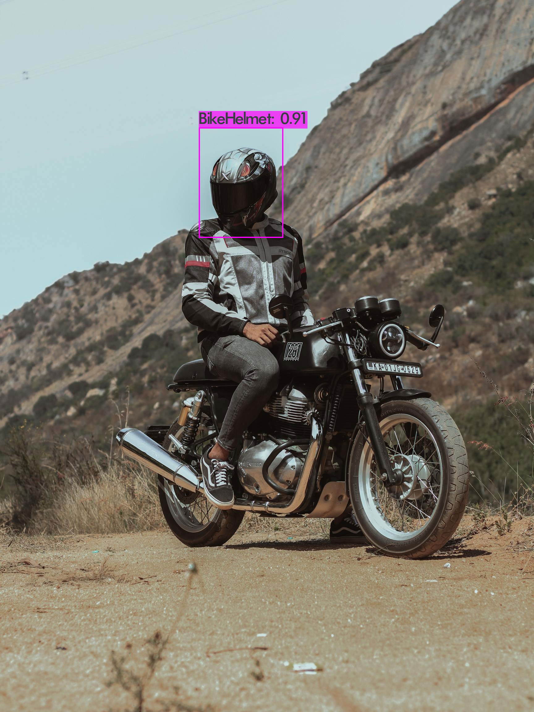
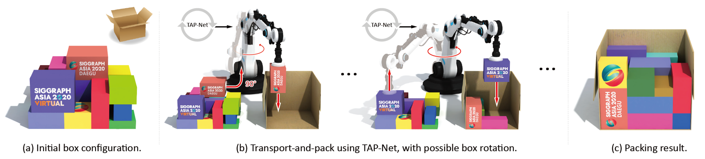

## 机器学习（监督学习与强化学习）

### 头盔检测应用

戴头盔是减少摩托车和自行车碰撞造成的头部受伤和死亡的最有效方法。不戴头盔的摩托车手头部受伤和死于这些伤害的风险要高得多 - WHO（世界卫生组织）。

为了提高骑摩托车和自行车的人的安全性，这里有头盔检测应用程序，这是一个人工智能驱动的计算机视觉应用程序，有助于自动检测骑摩托车和自行车的人的头盔。

### TAP-Net：使用强化学习进行运输和包装

给定箱子的初始空间配置，我们寻求一种有效的方法来迭代运输箱子并将其紧凑地包装到目标容器中。由于障碍物和可达性的限制，我们的问题必须为已经巨大的搜索空间增加一个新的搜索维度，即找到一个最佳的运输顺序，单独包装。

#### 视频

### 联系方式

胡洪伟 17855831981
徐志翔 17855831980
