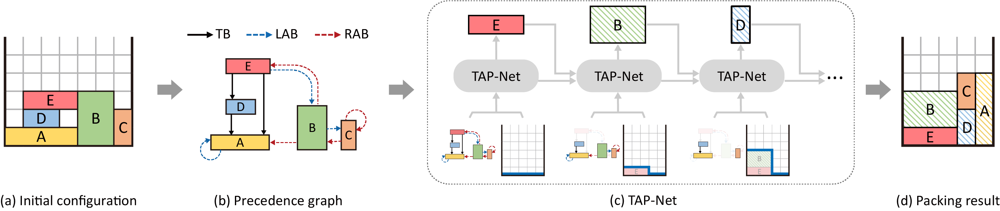

## 机器学习（监督学习与强化学习）

### 头盔检测应用

戴头盔是减少摩托车和自行车碰撞造成的头部受伤和死亡的最有效方法。不戴头盔的摩托车手头部受伤和死于这些伤害的风险要高得多 - WHO（世界卫生组织）。

为了提高骑摩托车和自行车的人的安全性，这里有头盔检测应用程序，这是一个人工智能驱动的计算机视觉应用程序，有助于自动检测骑摩托车和自行车的人的头盔。

### TAP-Net：使用强化学习进行运输和包装

我们介绍了运输和包装（TAP）问题，这是现实世界包装中经常遇到的实例，并开发了一种基于强化学习的神经优化解决方案。 给定箱子的初始空间配置，我们寻求一种有效的方法来迭代运输箱子并将其紧凑地包装到目标容器中。由于障碍物和可访问性的限制，我们的问题必须增加一个新的搜索维度，即找到一个最佳的em运输序列，到已经巨大的搜索空间中单独包装。使用基于学习的方法，经过训练的网络可以学习和编码解决方案模式，以指导新问题实例的解决方案，而不是执行昂贵的在线搜索。在我们的工作中，我们使用优先图表示运输约束，并训练一个神经网络，称为TAP-Net，使用强化学习来奖励高效和稳定的包装。

### Support or Contact

Having trouble with Pages? Check out our [documentation](https://docs.github.com/categories/github-pages-basics/) or [contact support](https://support.github.com/contact) and we’ll help you sort it out.
